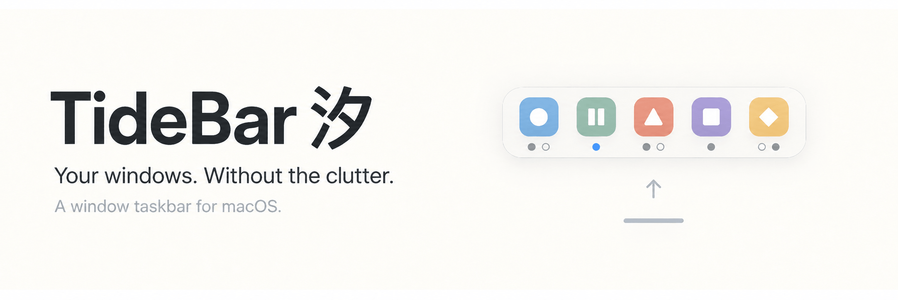

<p align="center">
  
</p>

[](https://github.com/d3ara1n/TideBar/releases/latest) [](https://github.com/d3ara1n/TideBar) [](LICENSE)

[下载](https://github.com/d3ara1n/TideBar/releases) · [官网](https://tidebar.dearain.dev) · [问题反馈](https://github.com/d3ara1n/TideBar/issues)

[English](README.md) · 简体中文

## 为什么是 TideBar

系统 Dock 常驻底部占据屏幕空间，最小化窗口难见难还原，除一个运行点外不提供窗口信息。TideBar 保留有用的部分——启动、切换、还原最小化窗口——去掉常驻的存在感。

| | 系统 Dock | TideBar |
|---|---|---|
| 屏幕空间 | 常驻底部一条栏 | 空闲时仅 2–3 pt 细线，靠近才展开 |
| 最小化窗口 | 难见难还原 | 图标下状态点，点击即还原 |
| 窗口可见性 | 只有运行点 | 逐窗口状态点 + 每应用窗口列表 |

TideBar 不追求复刻 Dock 的全部功能，专注两件事：零存在感，与窗口管理。

## 功能

### 汐线与展开

- 收起为随深浅色模式自适应的胶囊细线；鼠标靠近展开，离开收起。
- 全屏应用下默认让路——点击细线展开；可在「设置 → 外观与交互」改为靠近展开或完全隐藏。
- 支持多显示器，每块屏幕一条细线。
- 也可以纯键盘操作：**Option-Space** 随时显示或隐藏图标栏。

### 窗口管理

- 运行中应用图标下的窗口状态点：实心表示在屏窗口，空心表示已最小化，强调色表示当前聚焦，淡化表示位于其他显示器；窗口超过五个时以数字代替。
- 点击应用启动或在其窗口间循环切换——最小化窗口参与循环，点击即还原。
- 长按或 Option-click 应用打开「潮涌」：按标题列出该应用全部窗口，点击任意一项（含最小化）直达或还原。
- 系统 Dock 隐藏后，最小化窗口仍有归处：潮涌列表接替 Dock 的最小化托架。

### 条目与固定

- 应用、文件、文件夹都可以固定在运行中应用旁边；取消固定不删除文件、不退出应用。
- 栏内拖动调整顺序，拖出取消固定，从 Finder 拖入固定。文件拖到**应用图标**上用该应用打开；拖到**文件夹图标**上移入其中（仅限同一宗卷，不覆盖已有文件）。
- 右键应用可固定或取消固定、在 Finder 中显示、显示或隐藏窗口、退出应用。
- **应用收藏夹**把一组启动入口放在一起快速启动；不反映组内应用的运行状态。

### 安静的通知

- 应用角标从系统 Dock 镜像到 TideBar 图标上。
- 新角标让汐线轻涌一次，随后持续涟漪，直到展开图标栏或全部角标消失。展开只是确认提醒，不会把原应用里的消息标为已读。

## 安装

需要 **macOS 14 或更高版本**。

1. 从 [Releases](https://github.com/d3ara1n/TideBar/releases) 下载 `TideBar-<version>.zip`。
2. 解压后将 `TideBar.app` 移到「应用程序」。
3. 打开 TideBar。当前构建未经 Apple 公证；如果 macOS 阻止打开，请先尝试启动一次，再进入「系统设置 → 隐私与安全性」，选择「仍要打开」。
4. 按首次启动引导授予辅助功能权限，并启用 Dock 接管。

TideBar 会在菜单栏显示图标，可从菜单打开设置或退出。

## Dock 接管与恢复

只有启用 Dock 接管时，TideBar 才显示底部任务栏：

- 启用时它会保存当前的 Dock 设置，修改设置以隐藏 Dock，调整 Dock 图标大小与最小化动画，并重启 Dock 进程。
- 已打开的应用全程继续运行。

**恢复系统 Dock**：打开「设置 → Dock 与恢复」关闭接管，TideBar 会重新套用保存的设置。正常退出 TideBar 也会自动恢复。

**如果 TideBar 意外退出**（崩溃或被强制结束），保存的设置不会自动恢复，系统 Dock 会保持隐藏。恢复方法：

1. 重新打开 TideBar。
2. 进入「设置 → Dock 与恢复」，关闭接管即可恢复保存的 Dock 设置。

## 基本操作

| 操作 | 效果 |
|---|---|
| 鼠标靠近底部细线 | 展开图标栏，移开后收起 |
| 点击应用 | 启动应用或切换到最近的窗口；若窗口均已最小化，则恢复一个窗口 |
| 长按或 Option-click 应用 | 打开潮涌窗口列表；点击标题切换或恢复该窗口 |
| 右键点击应用 | 固定或取消固定、在 Finder 中显示、显示或隐藏窗口、退出应用 |
| 从 Finder 将应用、文件或文件夹拖到图标栏空隙 | 固定到任务栏 |
| 在栏内拖动固定项，或将它拖出栏外 | 调整顺序或取消固定；取消固定不删除原文件，也不退出应用 |
| 点击已固定的文件或文件夹 | 通过 macOS 打开 |
| 长按或 Option-click 文件夹 | 按修改时间列出其中的项目，最近修改的排在前面 |

从 Finder 将文件拖到**应用图标上**，会用该应用打开文件，前提是应用支持该文件类型。拖到**文件夹图标上**则会将文件移入该文件夹；仅支持同一宗卷内移动，不覆盖已有文件。

### 键盘操作

| 默认快捷键 | 操作 |
|---|---|
| Option-Space | 显示或隐藏图标栏，进入键盘导航 |
| Option-Tab | 循环选择应用，停止操作一小段时间后激活选中项 |
| 左 / 右方向键 | 选择应用 |
| 下方向键 | 打开所选应用的潮涌列表，随后向下选择窗口 |
| 上方向键 | 在窗口列表中向上选择 |
| Return | 激活选中项 |
| Escape | 关闭窗口列表；在应用层级时取消导航 |

全屏行为与外观选项在「设置 → 外观与交互」，全局快捷键与切换延迟在「设置 → 快捷键」。

## 权限与隐私

- **辅助功能**权限用于：读取窗口标题与状态、聚焦和恢复窗口、识别全屏应用、镜像 Dock 角标。未授权时仍可启动应用，但窗口管理受限。
- 不显示窗口缩略图，从不申请**屏幕录制**权限。
- 无账号系统、无统计分析、无任何遥测。唯一的联网行为是 Sparkle 经 GitHub Releases 检查更新（以及经你确认后下载更新）；自动检查可在「设置 → 关于」关闭。
- 文件访问遵循 macOS 标准访问控制。

## 已知限制

- 没有窗口预览或缩略图——为避免申请屏幕录制权限的刻意取舍。
- 没有废纸篓，也没有应用专属 Dock 菜单。
- 部分应用不提供可用的窗口信息；对它们可以启动应用，但无法管理窗口。
- 图标栏展开时覆盖在窗口上方，不会调整或移动你的窗口。
- 文件夹接收拖入仅在同名卷内移动，且不覆盖已有文件。

## 从源码构建

需要 macOS 和 Swift 6.2 或更高版本的工具链。克隆仓库后编译并运行：

```bash
git clone https://github.com/d3ara1n/TideBar.git
cd TideBar
swift build
swift run
```

运行期间保持终端打开，通过 TideBar 菜单栏菜单退出，以便恢复 Dock 设置。开发可执行文件与打包版应用需要分别授予辅助功能权限。检查更新和登录时启动仅在 `TideBar.app` 中可用。

## 反馈与贡献

通过 [Issues](https://github.com/d3ara1n/TideBar/issues) 报告问题或提出建议。报告问题时请附上 macOS 版本、TideBar 版本和复现步骤。欢迎提交 Pull Request，并说明修改的行为与验证方式。

## 许可证

[MIT](LICENSE)
